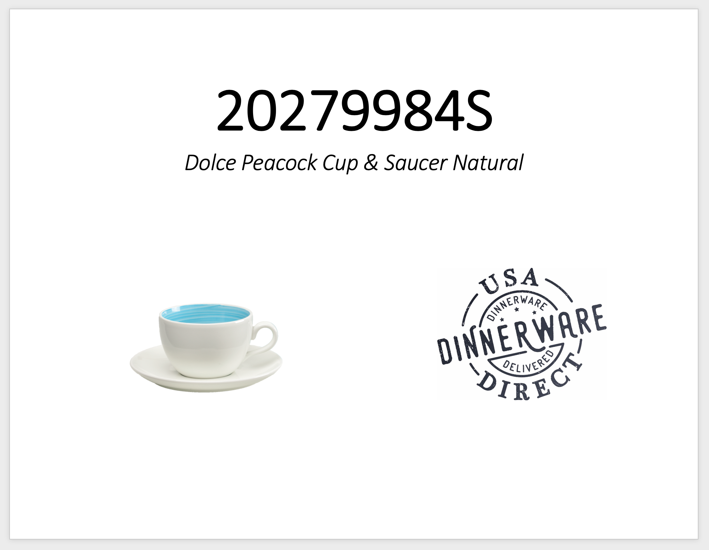
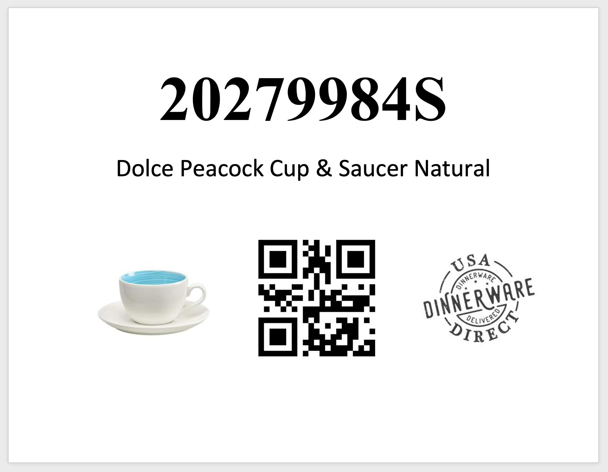

# USA Dinnerware Direct - <a href="https://www.usadinnerwaredirect.com">Link</a>

As part of my responsibilities at <a href="https://www.fiestatableware.com">The Fiesta Tableware Company </a> - we needed placards to help with inventory management.  The general idea is to make basic signage for each product that would help workers locate the product in the warehouse and make audits more efficient.  

Our store uses the Shopify platform which allows exporting all or selected collections of the products in the system in CSV format. 

CSV's are exported and I clean them manually.  First column is Product Title, second column is Product SKU, third column is Product Variant Image URL. 

Special thanks to <a href="https://www.youtube.com/watch?v=T9J8ZDRmehk" target="_blank">Tiger Online</a> for the great styling tutorial.
  

## Before & After

<figure>
    
    <figcaption>Original placards made by hand 1-by-1</figcaption>
</figure>
<figure>
    
    <figcaption>New placards made by this script</figcaption>
</figure>

 

Uses Py Docx to generate the document, urllib for requesting the image via Shopify CDN url, csv to read the products export from Shopify, and OS for minor changing of working directories. Creates the QR Code via QR Code package. Uses Pillow to concatenate three images into one new image.  

    The heading is the SKU

    The subheading is the product title 

    Images of the product, QR Code, and USADD logo 

  

## Updates

Uses QR Code lib to generate SKU QR Codes

    pip install qrcode

Uses Pillow to combine product image, QR Code, and USADD Logo into one new image - <a href="https://note.nkmk.me/en/python-pillow-concat-images/#concatenate-multiple-images-at-once">Specific Tutorial Link</a>